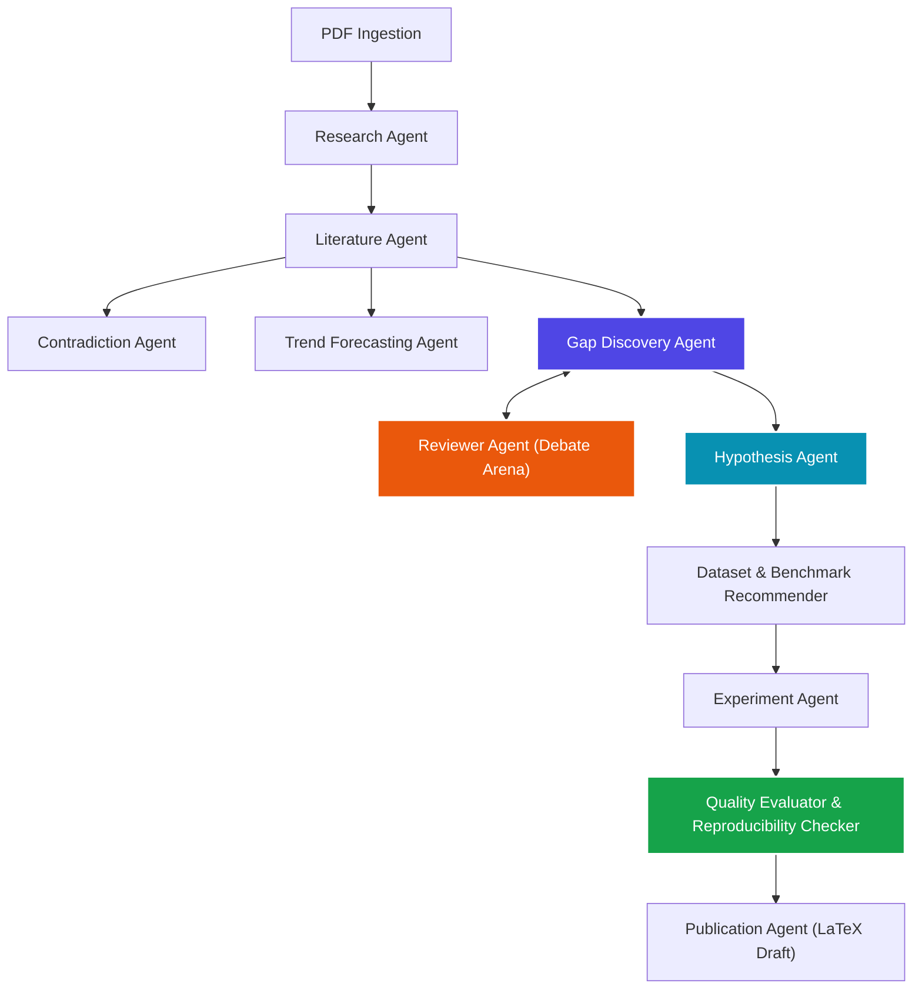

# 🧠 ScholarMind

> **Advanced Multi-Agent Research Intelligence Platform**  
> *Automating literature synthesis, contradiction analysis, research gap discovery, peer debate simulation, testable hypothesis generation, empirical experiment planning, and publication drafting.*

---

## 🌟 Hero Highlights & Rigor

ScholarMind is not just another "RAG research assistant." It is a comprehensive **Research Operating System** designed to enforce academic rigor and scientific traceability:

- **100% Traceable Lineage**: Click on any generated hypothesis and visually trace it back: `Hypothesis` $\rightarrow$ `Supporting Gap` $\rightarrow$ `Supporting Findings` $\rightarrow$ `Source Paper (and the exact verbatim passage)`.
- **Peer-Review Debate Arena**: Simulates authentic double-round academic reviews between a critical *Reviewer Agent* and a defending *Researcher Agent*.
- **Methodological Contradiction Detection**: Automatically isolates opposing empirical claims, parameter differences, and theoretical conflicts between papers, providing a granular root-cause analysis.
- **Reproducibility Audit Warning**: Scrapes generated experiments to audit variable completeness, alerting researchers of missing dataset controls or protocol specifics before drafting.

---

## 📐 Architecture & Multi-Agent Graph

ScholarMind coordinates a highly decoupled network of specialized LLM agents using **LangGraph / Python coordinator**:



---

## 🛠️ Feature Breakdown

### 1. Multi-Agent Pipeline
Runs a parallelized graph flow analyzing raw PDF extractions. Outlines problems, methodologies, and contributions dynamically.

### 2. Contradiction Detection
Isolates opposing empirical statements (e.g. *Paper A shows exponential scalability while Paper B reports linear boundaries under high latency*) and drafts technical clash metrics.

### 3. Debate Mode
Pairs the **Researcher Agent** against the **Reviewer Agent** inside an academic log window. Generates challenges, queries, and robust scientific defenses.

### 4. Interactive Co-Pilot Chat
A sliding drawer workspace chat connected to your SQLite workspace memory. Refines hypotheses, designs baseline models, and queries vector spaces dynamically.

### 5. Research Quality Evaluator & Reproducibility Checker
Scores generated ideas across five metrics (Novelty, Feasibility, Rigor, Reproducibility, Impact) and flags missing control variables or evaluation specifications.

---

## 💻 Tech Stack

### Frontend
* **Framework**: Next.js 15 (React 19)
* **Styling**: Tailwind CSS v4 (Harmony HSL Colors, Sleek Dark Mode, and Glassmorphic Panels)
* **Visualization**: React Flow (Conceptual Knowledge Graph layout mapping)

### Backend
* **API Framework**: FastAPI (Python 3.14 compatible)
* **Agent Flow**: Decoupled Python Graph Coordinator
* **LLM Engine**: Google Gemini API (`gemini-2.5-pro` & `gemini-2.5-flash` dynamic fallbacks)

### Storage & Vector Spaces
* **Session Storage**: SQLite Local Sync (`scholarmind.db`) with Zero-Dependency Supabase synchronization support
* **Embeddings**: `text-embedding-004` (3072-dimension dense vectors)
* **Vector Store**: Cosine Similarity vector database with auto-healing fallback to pure-Python mathematics if standard binaries are missing

---

## 🚀 Installation & Quick Setup

Follow these simple steps to spin up ScholarMind in less than 3 minutes:

### 1. Backend Server Setup
Ensure you have Python 3.10+ installed.

```bash
# Navigate to the backend folder
cd backend

# Create and activate a virtual environment
python -m venv .venv
# On Windows:
.venv\Scripts\activate
# On Linux/macOS:
source .venv/bin/activate

# Install dependencies
pip install -r requirements.txt

# Create your .env file
copy .env.example .env

# Start the FastAPI server
python -m app.api.main
```
*The backend API will start running at `http://127.0.0.1:8000`.*

### 2. Frontend Dashboard Setup
Ensure you have Node.js 18+ installed.

```bash
# Navigate to the frontend folder
cd ../frontend

# Install node dependencies
npm install

# Start the development server
npm run dev
```
*The Next.js dashboard will start running at `http://localhost:3000`.*

---

## 📂 Repository Structure

```
ScholarMind/
├── backend/            # FastAPI, Database Operations, and LangGraph Agents
├── frontend/           # Next.js 15 Dashboard, React Flow maps, and CSS Panels
├── docs/               # Technical Reports, Architecture details, and PDF documentation
├── .env.example        # Reference environment settings template
├── .gitignore          # Excludes DBs, envs, node_modules, and builds
├── LICENSE             # MIT Open Source License
└── README.md           # Project presentation index
```
